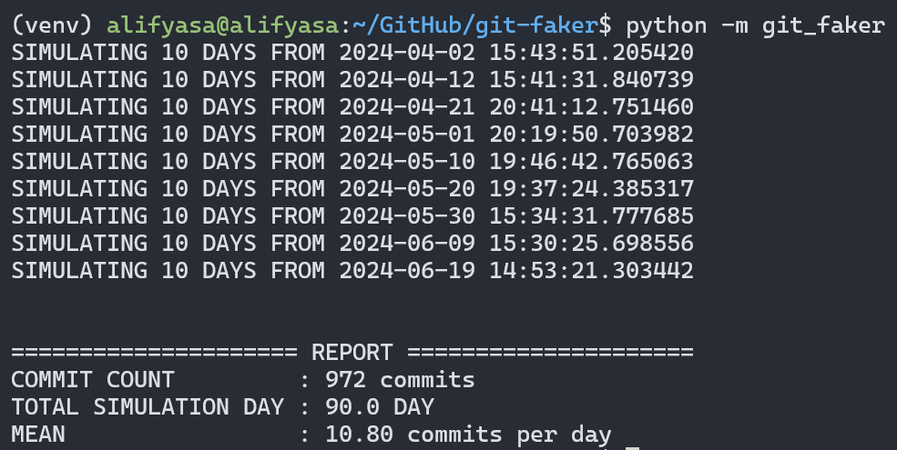
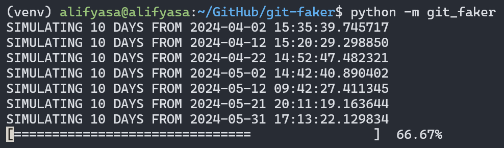

# Git Faker

Simulate git commit using non-homogenenous poisson process and create a git repository based on simulation result.

## Screenshots




## Initializing Environment

```shell
python3 -m venv venv
source venv/bin/activate
pip install -r requirements.txt
```

## Running Project

```shell
python -m git_faker
```

## Formatting and Linting

Formatting using `black`:

```shell
black git_faker
```

Linting using `pylint`:

```shell
pylint git_faker
```

## References

 1. [https://dspace.cuni.cz/bitstream/handle/20.500.11956/101040/120308816.pdf?sequence=1](https://dspace.cuni.cz/bitstream/handle/20.500.11956/101040/120308816.pdf?sequence=1)
